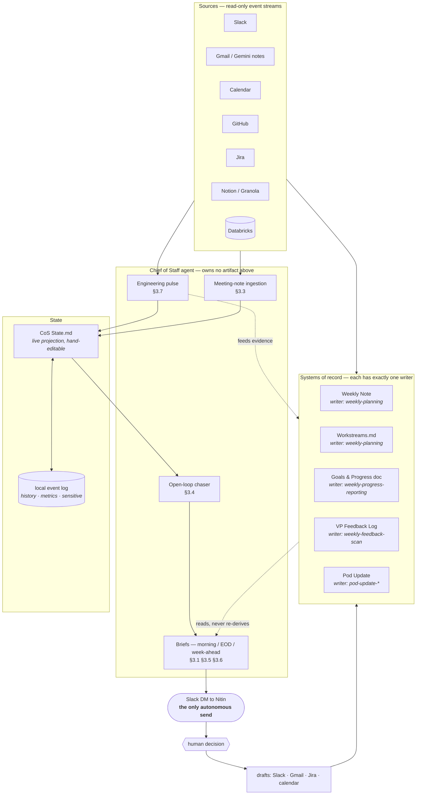

# Architecture

> How the pieces fit, as of 2026-09-05. Companion to [SPEC.md](SPEC.md) (what the agent does) and [BUILD.md](BUILD.md) (what gets built when).

## The shape of it

This is not one agent. It is **a set of routines with a strict division of labour, plus one new agent that fills the gap between them.**

That framing was arrived at, not designed. The spec was written as if the field were empty; it isn't — five routines already run, three of them live, and two separate attempts to hold state in this project immediately duplicated something a routine already owned. So the architecture is organised around one question: *who owns each artifact, and who is merely allowed to read it.*

## Ownership table — the load-bearing part

| Artifact | Sole writer | CoS may |
|---|---|---|
| `Weekly Notes/MMDD-MMDD.md` | `weekly-planning` | read; append commitments as checkboxes |
| `Fact Base/Workstreams.md` | `weekly-planning` (conflict-safe `base_version` upsert) | read; propose block diffs |
| Goals & Progress doc | `weekly-progress-reporting` | read; supply evidence |
| VP Feedback Log (Drive) | `weekly-feedback-scan` | supply evidence; **never read into any shared surface** |
| Notion pod update | `pod-update-*` | supply evidence |
| Jira / GitHub | the teams | read; draft transitions for approval |
| `Fact Base/CoS State.md` | **CoS** | own it |
| local event log | **CoS** | own it |
| Slack DM to Nitin | **CoS** | the one autonomous send |

CoS owns exactly two artifacts and one channel. Everything else it reads or drafts into. This is what keeps it from becoming the parallel task store principle 1 forbids.

## What CoS actually owns

The gap the existing routines leave: **everything between Fridays.** They are weekly, backward- or forward-looking, and artifact-shaped. Nothing was watching the day.

1. **Open loops** — a question asked and owed an answer, an ask assigned to a named person, a job running. Each carries an owner, a verbatim quote, a permalink, and a clock.
2. **Ingestion** — meeting notes classified into commitments / assigned asks / decisions / noise, written back to the artifacts their owners permit.
3. **Engineering pulse** — repo, CI, and board state, joined on ticket keys across Slack, PRs and notes. Not a loop of its own; a pre-step that three pushes consume.
4. **The daily rhythm** — morning brief, EOD wrap, Sunday week-ahead.

## State: two stores, split by requirement

`CoS State.md` and the event log are not redundant — they carry opposite requirements.

| | `Fact Base/CoS State.md` | local event log |
|---|---|---|
| holds | current chase list, watch items, snoozes, repo/Jira watch-lists | every transition, observation, run; §8 metrics |
| shape | markdown, ~30 rows, hand-editable | SQLite, append-mostly, unbounded |
| why | Nitin corrects it directly; it is the reason this isn't a black box | markdown cannot answer "median days-to-answer", and five scheduled loops writing one file with no locking is a lost update |
| location | the vault | **outside the vault** — iCloud syncs whole files; a WAL touched from two devices corrupts |

The log accumulates; the markdown is the current-state view. A hand edit is itself an event, and wins over derived state.

**The sensitive partition lives only in the log.** `weekly-feedback-scan` carries personnel items forward across reviews — structurally identical to a chase loop, but the vault is plaintext synced to every device Nitin owns, and chase entries exist to be surfaced in a brief. Those items never touch `CoS State.md`.

## Invariants

Six rules the whole thing rests on. Each was expensive to learn or is expensive to break.

1. **One writer per artifact.** The ownership table is the architecture; the rest is plumbing.
2. **Read, don't re-derive.** If a routine already produced it, consume its output. Violated twice in one session — a chase list copied out of Workstreams, and a Sunday brief re-synthesising Friday's plan.
3. **Evidence or silence.** Verbatim quote plus permalink, or say it can't be sourced. `weekly-feedback-scan` states the same rule as *"no link, no claim."*
4. **Drafts, not sends.** Exactly one autonomous channel: the DM to Nitin. Everything else waits for a per-item yes.
5. **Surface, don't resolve.** Conflicting dates, defunct invites, unverified "done" claims, a merged PR that may or may not be what was asked — flagged, never silently settled.
6. **Practice beats stated convention.** The weekly note *documents* a strike-and-move rule it does not follow; closed items are ticked in place. Follow the vault, not the doc — including this one.

## Execution context — the open axis

One decision (#24) propagates through everything above:

| | Local (this Mac) | Remote (cloud / home-lab) |
|---|---|---|
| vault | POSIX read/write; edit in place | connector only, create/append; every change a proposed diff |
| 6:45am brief | needs the machine awake | dependable |
| state log | `~/.local/state/` | must move with the runtime |

The trap: the home-lab box does not have this iCloud vault either, so the axis is **local vs remote**, not cron vs native. A split — local for write-heavy loops, remote for read-and-send — is coherent but adds a moving part.

## Scheduling

| Time | What | Owner |
|---|---|---|
| weekdays 6:40 → 6:45 | pulse → morning brief | CoS |
| weekdays 7:00 | D&T leadership monitor | existing routine |
| weekdays 12:00 / 17:00 | ingestion sweeps | CoS |
| weekdays 12:15 | open-loop chaser | CoS |
| weekdays 16:25 → 16:30 | pulse → EOD wrap | CoS |
| Fri 08:00 | pod update finalize | existing routine |
| Fri 13:00 | weekly planning + progress | existing routine |
| weekly | VP feedback scan | existing routine — **fed, never absorbed** |
| Sun 17:25 → 17:30 | pulse → week-ahead | CoS |

Five CoS schedules, not six: the pulse is a pre-step of three of them.

## Boundaries — deliberately outside

- **CreateOS platform hosting.** Parked (§7). Costs two-way Slack, platform observability, and any multi-user story; buys back not turning a personal tool into a product with an on-call surface.
- **Absorbing `weekly-feedback-scan`.** Its failure mode is a person's career record, and a "send nothing" rule is easier to keep intact in a standalone routine than inside an agent built to push messages.
- **Writing to Jira, the goals doc, or anyone's board.** Read, draft, let the human ship it.
