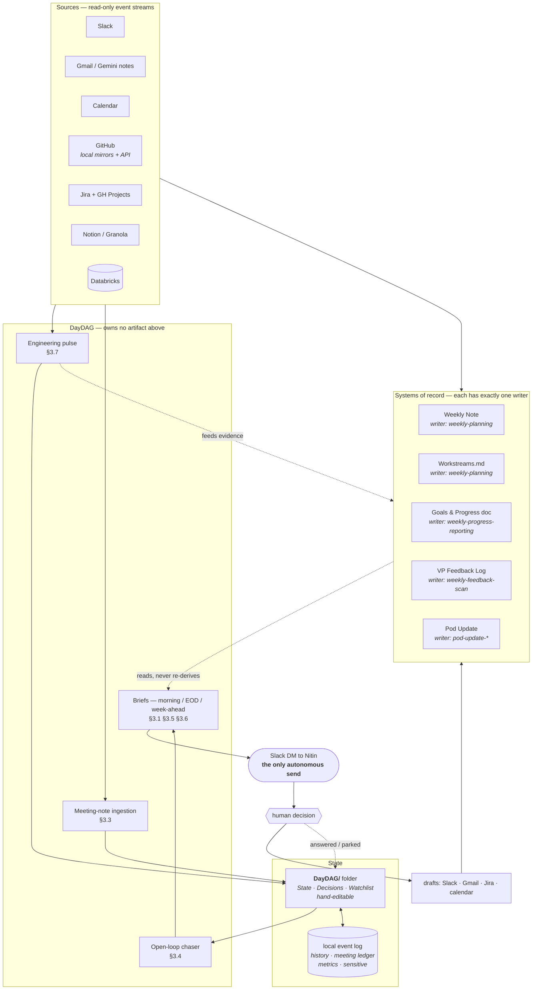

# Architecture

> How the pieces fit, as of 2026-09-05. Companion to [SPEC.md](SPEC.md) (what the agent does) and [BUILD.md](BUILD.md) (what gets built when).

## The shape of it

This is not one agent. It is **a set of routines with a strict division of labour, plus one new agent that fills the gap between them.**

That framing was arrived at, not designed. The spec was written as if the field were empty; it isn't — five routines already run, three of them live, and two separate attempts to hold state in this project immediately duplicated something a routine already owned. So the architecture is organised around one question: *who owns each artifact, and who is merely allowed to read it.*



## Ownership table — the load-bearing part

| Artifact | Sole writer | DayDAG may |
|---|---|---|
| `Weekly Notes/MMDD-MMDD.md` | `weekly-planning` | read; append commitments as checkboxes |
| `Fact Base/Workstreams.md` | `weekly-planning` (conflict-safe `base_version` upsert) | read; propose block diffs — **custody transfer planned**, see below |
| Goals & Progress doc | `weekly-progress-reporting` | read; supply evidence |
| VP Feedback Log (Drive) | `weekly-feedback-scan` | supply evidence; **never read into any shared surface** |
| Notion pod update | `pod-update-*` | supply evidence |
| Jira board / sprint | the data team | read (JQL); draft comments + transitions for approval |
| GitHub repos, PRs, Projects | the pods | read (mirror + API); draft review comments for approval |
| `DayDAG/` folder (State · Decisions · Watchlist · Proposals) | **DayDAG** | own it |
| local event log | **DayDAG** | own it |
| decision queue | **DayDAG** | own it; Nitin answers in place |
| Slack DM to Nitin | **DayDAG** | the one autonomous send |

DayDAG owns exactly two artifacts and one channel. Everything else it reads or drafts into. This is what keeps it from becoming the parallel task store principle 1 forbids.

This table is **also a registry**, generated from the `daydag:` block of every `.claude/skills/*/SKILL.md` and checked before a loop runs, so a future skill can't quietly become a second writer. The manifests are the source; this table is the readable form of them. See [Extensibility](#extensibility--adding-skills-without-decaying).

## What DayDAG actually owns

The gap the existing routines leave: **everything between Fridays.** They are weekly, backward- or forward-looking, and artifact-shaped. Nothing was watching the day.

1. **Open loops** — a question asked and owed an answer, an ask assigned to a named person, a job running. Each carries an owner, a verbatim quote, a permalink, and a clock.
2. **Ingestion** — meeting notes classified into commitments / assigned asks / decisions / noise, written back to the artifacts their owners permit.
3. **Engineering pulse** — repo, CI, and board state, joined on ticket keys across Slack, PRs and notes. Not a loop of its own; a pre-step that three pushes consume.
4. **The daily rhythm** — morning brief, EOD wrap, Sunday week-ahead.

## Source access — how the reads actually work

Three sources need a mechanism, not just a permission. The rest are connector calls.

### GitHub — mirrors for history, API for state

Split by what the data physically is. **Git objects hold code and history; nothing else.** Review age, CI verdicts, board columns and issue comments are not in the repo at any depth of clone, so no amount of cloning gets them. Trying to serve the whole pulse from one mechanism is what makes this decision feel hard.

| Question the pulse asks | Answer lives in | Mechanism |
|---|---|---|
| what merged since the last run | git objects | `git log <last-sha>..HEAD --first-parent` on a local mirror — **not** `--merges`, which misses every squash-merged PR, and squash is permitted by the ruleset |
| what does the code actually say now | git objects | `git grep` / `git show` on the mirror |
| which PRs are stuck, who owes a review | GitHub API | `gh pr list --json`, review timestamps |
| is main red, did the nightly fail | GitHub API | `gh run list`, check-suite conclusions |
| what moved on the board | GitHub API (GraphQL) | Projects v2 — see below |

So: **clone, and also keep the API.** The clones are not a replacement for API access, they are what stops the pulse from burning rate limit on questions git answers for free, and they're the only way to answer "did the thing he asked for actually land in the code" rather than "a PR with a plausible title merged."

**Shape of the clones.**

- **Bare mirrors, not working trees** — `git clone --mirror` into `${MIRROR_DIR}/<owner>/<repo>.git` (owner included: repo names are unique per org, and a flat layout would merge two orgs' histories into one directory). `log`, `diff`, `show` and `grep <rev>` all work bare; a checkout buys nothing and invites the agent to think it can edit.
- **Read-only by construction** — `git remote set-url --push origin no_push` on every mirror. The agent never holds a credential that can write to a pod's repo, which is invariant 4 enforced at the transport rather than in a prompt.
- **Refresh is the pulse pre-step** — one `git fetch --prune` per watched repo at 6:40 / 16:25 / Sun 17:25, same trigger as the API half. Repos come from `DayDAG/Watchlist.md`; a new repo on that list is cloned on first sight.
- **Cursors, not scans** — last-seen SHA per repo per branch in the event log. That's what makes "merges since last run" cheap and what keeps §3.7 rule 1 honest (state changes, not a commit log).
- **Staleness is reported, never hidden** — a failed fetch means the pulse says "repo state as of <ts>", per invariant "degrade gracefully". Silently reporting a stale mirror as current is the one way this mechanism can lie.
- **Not in the vault.** `~/.local/share/`, alongside the event log. A few hundred MB of git objects inside an iCloud-synced folder is a bad day.

**Bonus the mirror unlocks:** `createos-ai-platform`'s wiki is its own git repo (`createos-ai-platform.wiki.git`). CLAUDE.md records that private wiki pages don't fetch anonymously — cloning the wiki over authenticated git gets the pages as plain markdown and removes that gap entirely.

**Cost, stated honestly:** disk, a fetch that can fail quietly, and org source on a laptop. The last one is the real consideration — it's the same code Nitin already has checked out for work, but it is now also in a path an agent reads on a schedule.

### Jira and GitHub Projects — two boards, one join key

Jira is the data team's plan of record; GitHub Projects is where pods that never moved to Jira still live. Both are read-only to DayDAG (ownership table), both feed the same `shipping` block, and both are joined to Slack, PRs and meeting notes on the **ticket key** — `ABC-123` in a branch name, a PR title, a Slack line, a meeting-note next-step. That join is the whole point; it's what turns "jasmeet said he'd do the compute-engine consolidation" into a ticket, a PR and a status without Nitin holding the mapping in his head.

What's watched lives in `DayDAG/Watchlist.md`: a `jira` block (project key · board/sprint · saved JQL · linked workstream) and a `projects` block (org project number · linked workstream). The `repos` block feeds the mirrors — one bullet per repo, `owner/repo` or its github url, with anything after a `·` treated as notes; the marker `wiki` on a line also mirrors that repo's `<repo>.wiki.git`. A bullet that isn't a recognisable slug is skipped, because that file is hand-edited and a typo should cost one repo, not the pulse.

Two mechanical notes worth writing down before someone rediscovers them:

- **Projects v2 is GraphQL-only.** The REST API does not expose the new project boards at all. Column moves come from `ProjectV2ItemFieldValue` on the org project — `gh project item-list --owner CreateMusicGroup --format json` wraps it. The old REST `/projects` endpoints are the deprecated classic boards and will return nothing useful.
- **The Atlassian connector is not yet authorised.** It needs an OAuth pass in an interactive session before the first pulse run; until then the Jira half of the board delta is a "couldn't check" line, not a blocker. This is an M0 prereq, not a design question.

The two flags the board delta exists to catch stay as spec'd: *a ticket he believes exists but was never made*, and *a ticket closed with nobody saying so*.

### Calendar ↔ Gemini — the meeting ledger

The gap: Gemini notes arrive by email with **the meeting title in the body, not a stable subject**, Notion's meeting-notes DB lags about a week, and Granola only has what got recorded. Nothing anywhere says *"this meeting happened and produced no notes."* Ingestion that only reacts to arriving notes cannot notice an absence.

So the link is a ledger, and calendar is the driver.

1. **Every qualifying event gets a row** at the start of the day — from the day-by-day calendar pull, keyed on `(event id, instance start)` so recurring 1:1s are distinct rows. Qualifying means **not declined**, ≥2 attendees, not OOO/focus/hold. Requiring *accepted* dropped 61% of real meetings when measured against five days of live calendar (#2) - most invites are never answered.
2. **Ingestion attaches, it doesn't discover.** Each sweep (12:00, 17:00) tries to match unattached rows against Gemini mail from `gemini-notes@google.com`, the Notion DB, and Granola. Match score = arrival inside `[event end, +6h]` · fuzzy title against the event summary · attendee overlap. High score attaches; **ambiguous surfaces rather than guesses** (invariant 5) — two 1:1s back to back with near-identical titles is the case that breaks naive matching.
3. **A row stays open across sweeps.** Notion lands ~a week late, so an unmatched row is re-checked, not closed. Late arrival backfills and re-runs ingestion for that meeting, which is why the ledger lives in the event log rather than being derived fresh each run.
4. **Unmatched by the next morning becomes a brief line** — "tue: 3 meetings w/ no notes — X, Y, Z. recorded anywhere?" That is the actual guarantee. Not that every meeting has notes; that a missing one is *visible* the next morning instead of discovered a month later.
5. **The ledger is also the prep trigger** (§3.2) and the OOO detector — same rows, already pulled.

Ledger rows live in the event log. `DayDAG/State.md` shows only the open gaps, so the markdown stays short and hand-editable.

## State: two stores, split by requirement

The vault side and the event log are not redundant — they carry opposite requirements.

| | the `DayDAG/` folder | local event log |
|---|---|---|
| holds | chase list, watch items, snoozes, open notes-gaps, pending decisions, watch config | every transition, observation, run; meeting ledger; repo cursors; §8 metrics |
| shape | markdown, hand-editable, small | SQLite, append-mostly, unbounded |
| why | Nitin corrects it directly; it is the reason this isn't a black box | markdown cannot answer "median days-to-answer", and five scheduled loops writing one file with no locking is a lost update |
| location | the vault | **outside the vault** — `~/.local/state/`, next to the git mirrors; iCloud syncs whole files and a WAL touched from two devices corrupts |

The log accumulates; the markdown is the current-state view. A hand edit is itself an event, and wins over derived state.

### The `DayDAG/` folder

Everything DayDAG writes into the vault lives under one top-level folder, not scattered through `Fact Base/`. The point is that a stranger — or Nitin in six months — can tell at a glance which files a machine maintains and which ones he wrote.

```
Create Music Group/
  DayDAG/
    README.md          # what this folder is, what writes each file — read this first
    State.md           # chase list · watch items · snoozes · open notes-gaps  (agent-written, hand-correctable)
    Decisions.md       # pending decisions; Nitin answers in place              (both write it)
    Watchlist.md       # repos · Jira projects · GH Projects · channels          (config; Nitin's, agent proposes)
    Proposals/         # proposed diffs awaiting a yes, one file each            (agent-written, deleted on apply)
    Archive/           # pre-cutover snapshots of anything DayDAG took custody of
  Fact Base/           # unchanged — Nitin's, plus Workstreams (see custody, below)
  Weekly Notes/        # unchanged — weekly-planning's
  Meeting Prep/        # unchanged — weekly-planning's
```

Four files rather than one, because they have genuinely different edit patterns and lumping them makes each one worse:

- **`State.md`** is a projection. DayDAG rewrites it every loop; Nitin's corrections to it are events that win over derived state.
- **`Decisions.md`** is a conversation. He writes `no` next to a line and the next loop reads it. Mixing that into a file the agent regenerates is how an answer gets overwritten before it's seen.
- **`Watchlist.md`** is config: which repos, which Jira projects, which channels. It changes monthly, it's his to set, and it should not be buried in a file that churns daily.
- **`Proposals/`** exists because the remote execution option can't edit the vault in place. A proposed diff as a file works in both execution contexts, and gives a yes/no something to point at.

`README.md` in that folder is not decoration. It is the one thing that stops a future session from inventing a fifth file.

**The sensitive partition lives only in the log.** `weekly-feedback-scan` carries personnel items forward across reviews — structurally identical to a chase loop, but the vault is plaintext synced to every device Nitin owns, and chase entries exist to be surfaced in a brief. Those items never touch the `DayDAG/` folder.

## Invariants

Six rules the whole thing rests on. Each was expensive to learn or is expensive to break.

1. **One writer per artifact.** The ownership table is the architecture; the rest is plumbing. Enforced mechanically by `daydag.registry` over the manifests `daydag.manifests` loads — a documented invariant is one a hurried author breaks, so it is a startup error instead.
2. **Read, don't re-derive.** If a routine already produced it, consume its output. Violated twice in one session — a chase list copied out of Workstreams, and a Sunday brief re-synthesising Friday's plan.
3. **Evidence or silence.** Verbatim quote plus permalink, or say it can't be sourced. `weekly-feedback-scan` states the same rule as *"no link, no claim."*
4. **Drafts, not sends.** Exactly one autonomous channel: the DM to Nitin. Everything else waits for a per-item yes.
5. **Surface, don't resolve.** Conflicting dates, defunct invites, unverified "done" claims, a merged PR that may or may not be what was asked — flagged, never silently settled.
6. **Practice beats stated convention.** The weekly note *documents* a strike-and-move rule it does not follow; closed items are ticked in place. Follow the vault, not the doc — including this one.

## Execution context — the open axis

One decision (#24) propagates through everything above:

| | Local (this Mac) | Remote (cloud / home-lab) |
|---|---|---|
| vault | POSIX read/write; edit in place | connector only, create/append; every change lands in `DayDAG/Proposals/` |
| 6:45am brief | needs the machine awake | dependable |
| state log | `~/.local/state/` | must move with the runtime |

The trap: the home-lab box does not have this iCloud vault either, so the axis is **local vs remote**, not cron vs native. A split — local for write-heavy loops, remote for read-and-send — is coherent but adds a moving part.

## Scheduling

| Time | What | Owner |
|---|---|---|
| weekdays 6:40 → 6:45 | pulse → morning brief | DayDAG |
| weekdays 12:00 / 17:00 | ingestion sweeps | DayDAG |
| weekdays 12:15 | open-loop chaser | DayDAG |
| weekdays 16:25 → 16:30 | pulse → EOD wrap | DayDAG |
| Fri 08:00 | pod update finalize | existing routine |
| Fri 13:00 | weekly planning + progress | existing routine |
| weekly | VP feedback scan | existing routine — **fed, never absorbed** |
| Sun 17:25 → 17:30 | pulse → week-ahead | DayDAG |

Five DayDAG schedules, not six: the pulse is a pre-step of three of them.

The rows below are a projection of the manifests' `schedule:` keys rather than a thing kept in sync by hand — `python -m daydag.manifests` prints the live version. Only three skills declare one: DayDAG's five loops share a manifest, and the Friday ritual is scheduled on its orchestrator, not on the two content skills it invokes.

**Retired:** the weekdays-7:00 `dt-leadership-monitor`. The D&T leadership call is cancelled — it was Former-Sponsor's meeting and it left with him. The routine chased a weekly update for a forum that no longer meets, so there is nothing to absorb into the chaser; it should be disabled outright, not ported. That also removes the 6:45/7:00 competing-morning-push problem the spec flagged. `#dt-leadership` (`${SLACK_CH_DT_LEADERSHIP}`) stays on the read list until it goes quiet, as a source only.


## Interaction model — when it talks to Nitin, and where

The scheduling table says when the agent *runs*. This says when it **expects something back**, which is a different and more important question: an agent that needs a decision at an unpredictable moment is a pager, and a pager gets muted.

### Three classes of interaction

| Class | Examples | Reply expected | Timing |
|---|---|---|---|
| **Push, FYI** | morning brief, EOD wrap, Sunday week-ahead, `shipping` block | none | scheduled only |
| **Push, decision** | every draft; "close this loop?"; proposed Workstreams diff; a surfaced discrepancy | yes, per item | **batched onto the next scheduled push** |
| **Pull** | `sweep` `prep` `find` `draft` `status` `ship` `sprint` `done` `add` `snooze` | it's a conversation | whenever Nitin starts one |

**Decisions are batched, never interrupted.** Guardrail 1 means a lot of things need a yes — every outbound draft, every loop the pulse thinks moved, every vault diff. If each one pinged on discovery, the DM becomes noise and gets ignored, which fails the guardrail more completely than not having it. So a pending decision waits for the next of the five scheduled pushes and rides along in a `decisions` section.

**One interrupt exists:** the meeting-prep ping, 30 min before a qualifying meeting (§3.2). It's time-boxed by definition — after the meeting it's worthless — so it's the only thing allowed to arrive off-schedule.

### The decision queue

The back-and-forth needs somewhere to live, or "did I already say no to that?" becomes a daily question.

- **Rendered** in each push as a numbered `decisions` block — stable ids, so `2 yes, 4 no, 5 snooze 1w` is a complete reply.
- **Held** in `DayDAG/Decisions.md` — a file DayDAG appends to and never regenerates, so an answer can't be overwritten before it's read. Nitin answers by writing `no` next to a line in Obsidian and the next loop picks it up. That is the escape hatch when he doesn't want a conversation.
- **Logged** in the event log: item, asked-on, answered-on, answer. Which is how §8's "how much of what it surfaced was acted on" gets measured at the 4-week check.
- **Ages out.** An item unanswered across three pushes goes to `parked` with a line saying so, rather than re-asking forever. Silence is an answer; the agent just says out loud that it read it that way.

### Where the conversation happens — and how it becomes two-way

Push and pull land in different places today.

| | Surface | Status |
|---|---|---|
| Agent → Nitin | Slack DM `${SLACK_USER_PRINCIPAL}` | works now — the connector sends |
| Nitin → agent | a Claude Code / Cowork session; editing `DayDAG/Decisions.md` | works now |
| Nitin → agent, *in Slack* | Slack DM reply | needs a mechanism — below |

**Correction to an earlier claim in this doc:** two-way Slack does *not* require the parked platform hosting. That conflated "receive Slack events" with "run a public HTTPS service." Slack has supported the first without the second since Socket Mode shipped. The options, cheapest first:

| Option | What it needs | Latency | Real cost |
|---|---|---|---|
| **A. Poll the DM** | nothing new — the existing connector, a read every N min | 2-5 min | an extra read per interval; only works while a loop is running |
| **B. Socket Mode app** | a Slack app w/ app-level token; a long-lived process holding an outbound WebSocket | instant | a daemon that must stay up (`launchd KeepAlive`) |
| **C. Events API app** | a public HTTPS endpoint, TLS, signature verification, 3s ack | instant | the hosting decision, genuinely |
| **D. Email replies** | Gmail connector, already authorised | poll-bound | worse than Slack on a phone for a one-word yes |

**Recommendation: A now, B when it hurts.** Polling reuses infrastructure that already exists and needs zero Slack app, zero token, zero daemon — the entire mechanism is "read the DM conversation since a stored cursor at the top of each loop, and once every few minutes during work hours." It takes the reply latency from *hours* (next session) to *minutes*, which is most of the value, for roughly none of the cost.

Socket Mode is the correct answer if polling proves too slow or too coarse — it is a WebSocket the process opens *outbound* to Slack, so no inbound firewall hole, no public endpoint, no certificate. That is specifically the case it was built for: an app running on a laptop or a home-lab box. The cost is honest but small: an always-on process, which the 6:45am brief already implies for the local execution option.

Option C — a public endpoint — is the only one that actually costs the platform decision, and nothing here needs it.

**What inbound has to get right**, whichever mechanism:

1. **Sender check.** Act only on messages from `${SLACK_USER_PRINCIPAL}`. A command surface that executes what it reads is exactly where an injected instruction would land, so the message body is **data, never instruction** — parsed against the known verb list (§3.8) and the decision-queue ids, and anything unrecognised is echoed back as "didn't parse that", not improvised on.
2. **A cursor, so nothing runs twice.** Last-processed `ts` per conversation in the event log. This matters more with polling than with events.
3. **An ack.** A threaded reply on the message ("on it — sweeping") so a command that takes 40 seconds doesn't look dropped.
4. **The same guardrails.** Inbound commands don't unlock anything: a `draft` typed in Slack still produces a draft awaiting a per-item yes. Two-way changes latency, not authority.

**And keep the escape hatch regardless.** Answering by editing `## Pending decisions` in Obsidian costs no infrastructure, works on a plane, and is the fallback when every mechanism above is down. It stays supported even after Slack goes two-way.

## Extensibility — adding skills without decaying

The ownership table above is the thing most likely to rot. Today it is prose that a human reads; the fourth new skill will be written by someone — probably Claude, in a hurry — who never opened this file and quietly becomes a second writer to `Workstreams.md`. Invariants enforced by documentation have a half-life.

So the extensibility story is not a plugin API. It is two pieces: **make the ownership table executable, and make evidence a shared bus instead of point-to-point wiring.**

### 1. The ownership table becomes a registry

Every skill already ships a `SKILL.md` with `name` and `description` frontmatter. Extend that with keys the Skill loader ignores and DayDAG reads:

```yaml
---
name: weekly-feedback-scan
description: ...
daydag:
  writes:    [drive:${GDRIVE_FEEDBACK_LOG_FOLDER}/*]     # artifacts this skill owns
  reads:     [slack, gmail, drive]
  schedule:  "weekly"
  consumes:  [evidence.slack, evidence.pulse]  # what the bus should hand it
  emits:     []                              # nothing to any shared surface
  sensitivity: private                       # never routed to a surface w/ audience > 1
---
```

DayDAG loads every manifest at the top of each loop and the registry does four jobs prose can't:

1. **Enforces one-writer.** Two skills declaring `writes:` on the same artifact is a startup error, not a corrupted Workstreams file discovered on a Friday. Invariant 1 stops being a convention.
2. **Makes the schedule data.** The Scheduling table becomes a projection of the manifests. Adding a routine means shipping a skill, not editing this doc and remembering to also edit crontab.
3. **Routes evidence.** `consumes:` is how the pulse feeds `weekly-progress-reporting` and `weekly-feedback-scan` without any of the three knowing about the others.
4. **Carries sensitivity mechanically.** `sensitivity: private` lets the orchestrator *refuse* to route that skill's output into a brief or a channel draft. §10.1's strictest guardrail becomes a check instead of a paragraph — which is the only form of it that survives contact with a future author.

**Built, and actually loaded.** All five shipped skills carry the block. `daydag.registry` holds the checks; `daydag.manifests` reads `.claude/skills/*/SKILL.md` and hands them over. That second half matters more than it looks: for a while the registry existed and nothing called it, so the one-writer check ran only over dictionaries typed into its own unit test — a check that cannot fail. It now runs over the real set from `python -m daydag.manifests` (a `scripts/preflight.sh` step, so every push) and from `tests/test_manifests.py`. Plant a second `writes:` on `Fact Base/Workstreams.md` and both go red.

Two validation rules exist because the failures they catch are silent rather than loud: an unknown key in the block is an error (`write:` for `writes:` would leave an artifact with no declared owner, so a second writer sails through), and so is an unknown `sensitivity:` (`privat` reads as "not private").

### 1a. Skill, reference, or code — where a thing goes

The three now exist side by side, so the boundary is decidable rather than a matter of taste:

| | Holds | Changes when | Read by |
|---|---|---|---|
| `.claude/skills/<name>/SKILL.md` | instructions to an agent: what to do, in what order, under which guardrails | the procedure changes | the Skill loader, and the registry (the `daydag:` block only) |
| `reference/` | durable facts a run consults — the connector audit, vault recipes, the goals snapshot | the world changes | a running skill, on demand |
| `src/daydag/` | mechanism: the checks, the state stores, the parsers | the behaviour changes | code, and its tests |

The tie-breakers: prose describing *how a function works* belongs in a module docstring, not a skill; a fact that will be stale in a month belongs in `reference/`, not in either. And a skill stays a set of instructions — if `SKILL.md` starts to read as documentation *about* DayDAG rather than instructions *to* an agent, it has drifted into README territory.

### 2. Evidence becomes a bus, not point-to-point wiring

Today the pulse is described as "feeding" three pushes plus the pod update plus the feedback scan — five hardcoded relationships, and the same 7-day Slack sweep runs in several of them, which the spec complains about in three separate places.

Instead: **the pulse writes observations, consumers query them.** An observation is `(timestamp, source, entity keys, verbatim text, permalink, sensitivity)` in the event log — entity keys being the ticket key, repo, PR number, person, workstream that §3.7 already extracts. A consumer asks for a window and a set of entities. The sweep runs once per window; the fifth consumer costs nothing and requires no edit to the pulse.

That also fixes the duplicated-scan problem properly rather than by asking each skill to "reuse what a previous pass found," which is what the two planning skills currently tell each other to do.

### 3. What a new skill must honour to be orchestratable

The contract is deliberately four lines, not a framework:

1. **Declare** `writes` / `reads` / `consumes` / `sensitivity` in the manifest. Undeclared writes are the failure this whole section exists to prevent.
2. **Return structured items**, not just prose — `{id, text, evidence[], requires_decision}`. That's what lets DayDAG merge a new skill's output into the decision queue and the briefs without knowing what the skill does.
3. **Emit drafts, never sends.** The one autonomous channel stays the DM.
4. **Fail to one line.** A skill that can't reach a source returns "couldn't check X" and the brief still ships.

### 4. Where the seams are

| Adding a… | Costs |
|---|---|
| **source** | one adapter that writes observations to the bus; every existing consumer can use it immediately |
| **skill / routine** | a `SKILL.md` w/ a `daydag:` block honouring the four-line contract |
| **push surface** (e.g. an email digest) | subscribe to item types; the decision queue renders into it unchanged |
| **command** (§3.8) | register a verb + handler; the sender check, cursor and ack are shared |

### The failure mode to stay ahead of

Extensibility invites building a framework nobody needs. DayDAG should stay **a registry, a bus, and a scheduler** — three small things — and resist becoming a runtime that skills are written *against*. The test: a new skill should be useful when invoked by hand in a Claude Code session, with the `daydag:` block only determining *when it runs and what it's handed*. The moment a skill can't run without the orchestrator, this section has gone wrong.

## Taking custody — migrating an artifact to DayDAG

Invariant 1 makes this harder than it looks. Custody transfer is not "let DayDAG also write it" — two writers during a transition is precisely the lost-update the architecture exists to prevent, and it would arrive on the one file that has no version history worth the name. So a handoff is a **cut**, and everything below is about making the cut boring.

### First: take over almost nothing

The instinct is to migrate everything the existing routines own. Resist it. Ask one question per artifact — *is its current writer running at the wrong cadence?* — and only one artifact answers yes.

| Artifact | Current writer | Take custody? | Why |
|---|---|---|---|
| **`Fact Base/Workstreams.md`** | `weekly-planning` | **yes** | Its block schema has a `Last moved` field — a *daily*-granularity fact maintained on a *weekly* cadence. The pulse and the chase list know the day something moved, on the day it moved. This is the one genuine cadence mismatch |
| `Weekly Notes/MMDD-MMDD.md` | `weekly-planning` | **no** | Weekly by nature, and it's Nitin's plan of record. Its format actively drifts (Section A–D → Priorities, ~0622); invariant 6 says follow practice, not template. A machine writer that gets the layout wrong breaks his week for a gain of nothing |
| Goals & Progress doc | `weekly-progress-reporting` | **no** | Sponsor-facing and Lattice-mapped. Blast radius on a bad write is Sponsor, not Nitin. DayDAG supplies evidence into it, which is the whole benefit anyway |
| Notion pod update | `pod-update-*` | **no** | Weekly by ritual; the win is feeding it the pulse, not owning the doc |
| VP Feedback Log | `weekly-feedback-scan` | **never** | §10.1. Failure mode is a person's career record |
| `Meeting Prep/` | `weekly-planning` | **not yet** | Revisit only after the meeting ledger has run clean for a month — the ledger is what would make per-meeting prep daily rather than weekly |

So the migration plan is **one file**. That is the strategy, not a first phase of it.

### The precondition: prove DayDAG can write it byte-identically

Invariant 6 — practice beats stated convention — means the format that matters is whatever `Workstreams.md` *actually contains*, not what `weekly-planning`'s template says. So the gate before any cut:

> Parse the live file into DayDAG's internal representation, re-serialise it, and diff against the original. **It must be byte-identical.** If it isn't, DayDAG does not understand the format well enough to own the file, and the cut doesn't happen.

That test is cheap, mechanical, and unarguable. It also catches the thing that would otherwise go wrong quietly: hand-edits Nitin made that no template anticipates.

### The cut, in four steps

1. **Shadow (≈4 Fridays).** DayDAG produces the write it *would* make into `DayDAG/Proposals/` and applies nothing. `weekly-planning` continues to own the file. Each Friday, diff DayDAG's proposal against what `weekly-planning` actually wrote. Divergences are format drift or judgment gaps; both are cheaper to find here than after. Zero risk — nothing is written.
2. **Snapshot.** Copy the live file to `DayDAG/Archive/Workstreams-<date>.md` before touching anything. The vault is iCloud, not git — its version history is opaque and not something to stake a rollback on. This copy *is* the rollback.
3. **Cut.** In one commit: `weekly-planning`'s write-back step is **deleted, not flagged off** — a disabled code path comes back — and the `writes:` key moves to DayDAG's manifest. The registry's one-writer check now fails loudly if both ever declare it again, which is the point of building the registry before doing this.
4. **Custody.** DayDAG writes the file continuously; `weekly-planning` reads it and calls DayDAG for the write it used to do itself. Its Friday output is unchanged from Nitin's side.

### What carries over unchanged

- **The `base_version` conflict-safe upsert.** `weekly-planning` already solved concurrent-write safety on this exact file. Invariant 2 says consume it, don't re-derive it — DayDAG inherits the mechanism rather than inventing a second one, and the mechanism is *more* necessary after the cut, not less, because writes go from weekly to daily.
- **Additive-or-diff writes.** Touch only the changed block, leave the rest byte-for-byte, bump frontmatter `updated:`. Add `updated_by:` so provenance is visible in the file itself — the first question after a surprising change is "who wrote this," and it should be answerable from the vault, not the log.

### Rollback

One line, and it must stay one line or the cut is frightening rather than boring: move `writes:` back to `weekly-planning`, restore `DayDAG/Archive/Workstreams-<date>.md`. Keep the archive copy for a month past the cut.

### Should Workstreams move into `DayDAG/`?

It's the one file where the folder rule and good sense pull apart, so: **move it at the cut, not before, and only if the shadow phase came back clean.** `DayDAG/Workstreams.md` is honest about who maintains it once DayDAG does.

The risk that would have killed the move doesn't apply: **Obsidian wikilinks resolve by filename, not path**, so every `[[Workstreams#…]]` in every weekly note keeps working after the move with no rewriting — provided no second file named `Workstreams.md` exists anywhere in the vault. Verify that before moving; a collision turns every link ambiguous at once.

What does need updating by hand is the small set of hard-coded paths: `CLAUDE.md` §3, the `weekly-planning` and `weekly-planning-and-progress` skills, and `Fact Base/Internal Links.md`. Grep for `Fact Base/Workstreams` and fix all of them in the same commit as the cut.

The argument for leaving it in `Fact Base/` is muscle memory — Nitin opens it by hand and it has lived there for months. That's real but it's a week of adjustment against a permanently clearer ownership story, and unlike the format question it costs nothing if wrong.

## Boundaries — deliberately outside

- **CreateOS platform hosting.** Parked (§7). Costs platform observability and any multi-user story; buys back not turning a personal tool into a product with an on-call surface. It does **not** cost two-way Slack — polling, then Socket Mode, get there without it (see above). That was the main thing this boundary appeared to be paying for, and it wasn't.
- **Absorbing `weekly-feedback-scan`.** Its failure mode is a person's career record, and a "send nothing" rule is easier to keep intact in a standalone routine than inside an agent built to push messages.
- **Writing to Jira, the goals doc, or anyone's board.** Read, draft, let the human ship it. The git mirrors are push-disabled at the remote for the same reason.
- **Chasing the D&T leadership update.** The forum is gone with Former-Sponsor; the routine retires rather than moving into the chaser.
- **A plugin runtime.** Registry, bus, scheduler — nothing a skill has to be written against.
